# Diagramas de Flujo de Datos (DFD)
## MVP – Mesa de Ayuda con Canal Web y WhatsApp

### 1. Objetivo de los diagramas

Los siguientes Diagramas de Flujo de Datos (DFD) describen de forma visual el funcionamiento del MVP de Mesa de Ayuda. Su propósito es representar las entidades externas, procesos internos, almacenes de datos y flujos de información que intervienen desde la recepción de una solicitud hasta su clasificación, asignación, seguimiento, resolución y cierre.

El diseño parte del principio de que el MVP debe ser funcional aun cuando la integración con el SGA institucional no se encuentre disponible. Para ello se considera una fuente local de datos de prueba y una capa de abstracción que permitirá incorporar posteriormente un proveedor de datos institucionales sin alterar la lógica principal del sistema.

---

## 2. Convenciones utilizadas

| Elemento | Significado |
|---|---|
| Entidad externa | Actor o sistema que intercambia información con el MVP |
| Proceso | Transformación o procesamiento de información |
| Almacén de datos | Persistencia de información en MySQL |
| Flujo de datos | Información que se mueve entre entidades, procesos y almacenes |
| LLM | Modelo de lenguaje utilizado como componente de apoyo semántico |
| SGA | Sistema de Gestión Académica institucional |

---

# Figura DFD-01. Diagrama de Contexto – Nivel 0

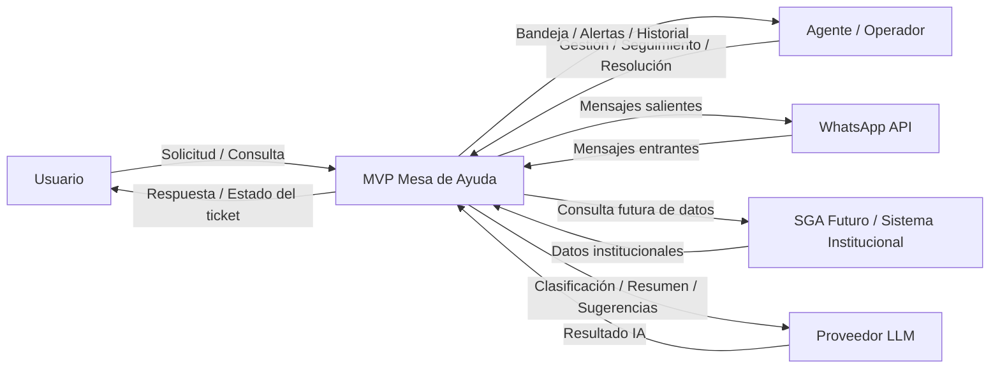

**Descripción:**  
El MVP se presenta como un único sistema que interactúa con usuarios, operadores, WhatsApp, un proveedor LLM y, en una fase posterior, con el SGA institucional. El LLM actúa como un componente de apoyo y no como controlador principal del proceso.

---

# Figura DFD-02. Diagrama General del Sistema – Nivel 1

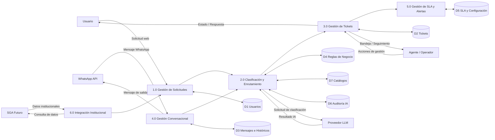

**Descripción:**  
El sistema se divide en seis procesos principales: recepción de solicitudes, clasificación y enrutamiento, gestión de tickets, gestión conversacional, control de SLA e integración institucional. La información se almacena en estructuras propias del MVP dentro de MySQL.

---

# Figura DFD-03. Registro y Creación de Ticket – Nivel 2

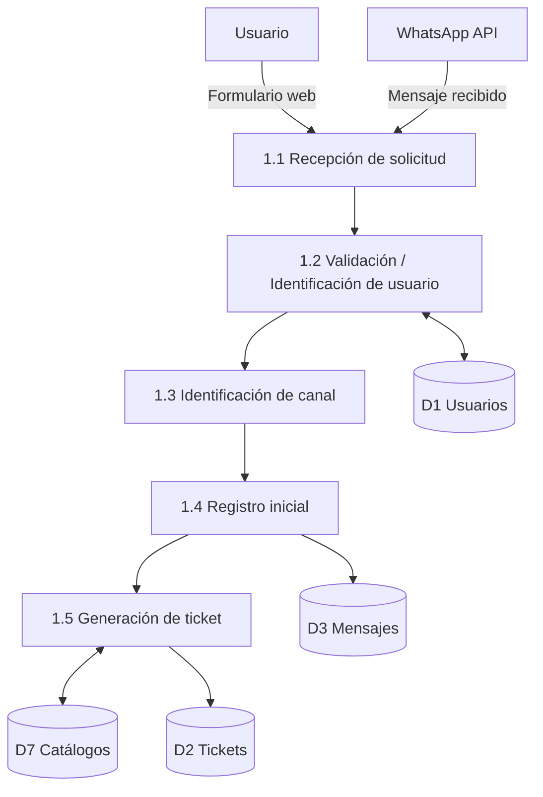

**Descripción:**  
Toda solicitud recibida por web o WhatsApp es identificada, asociada a un usuario y registrada. Posteriormente se genera un ticket único. En el MVP, la identificación del usuario podrá realizarse con información local; posteriormente podrá enlazarse con datos institucionales.

---

# Figura DFD-04. Clasificación y Enrutamiento – Nivel 2

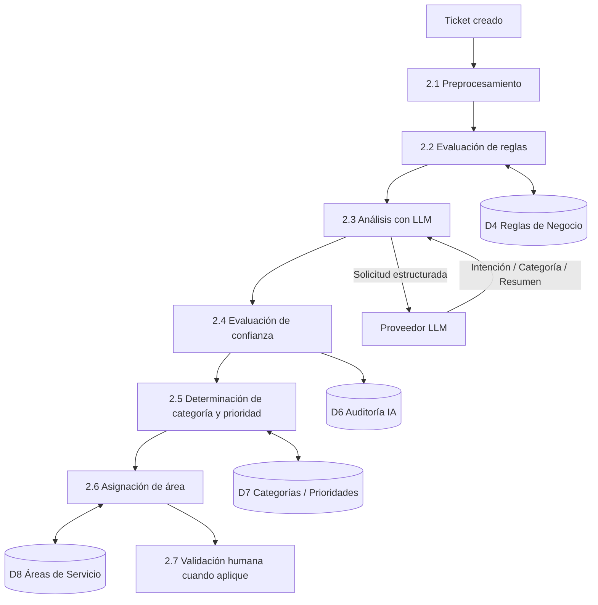

**Descripción:**  
La clasificación se realiza mediante una combinación de reglas determinísticas y apoyo del LLM. El resultado del LLM no se aplica directamente; debe pasar por validación estructural, reglas de negocio y umbrales de confianza.

---

# Figura DFD-05. Atención Conversacional por WhatsApp – Nivel 2

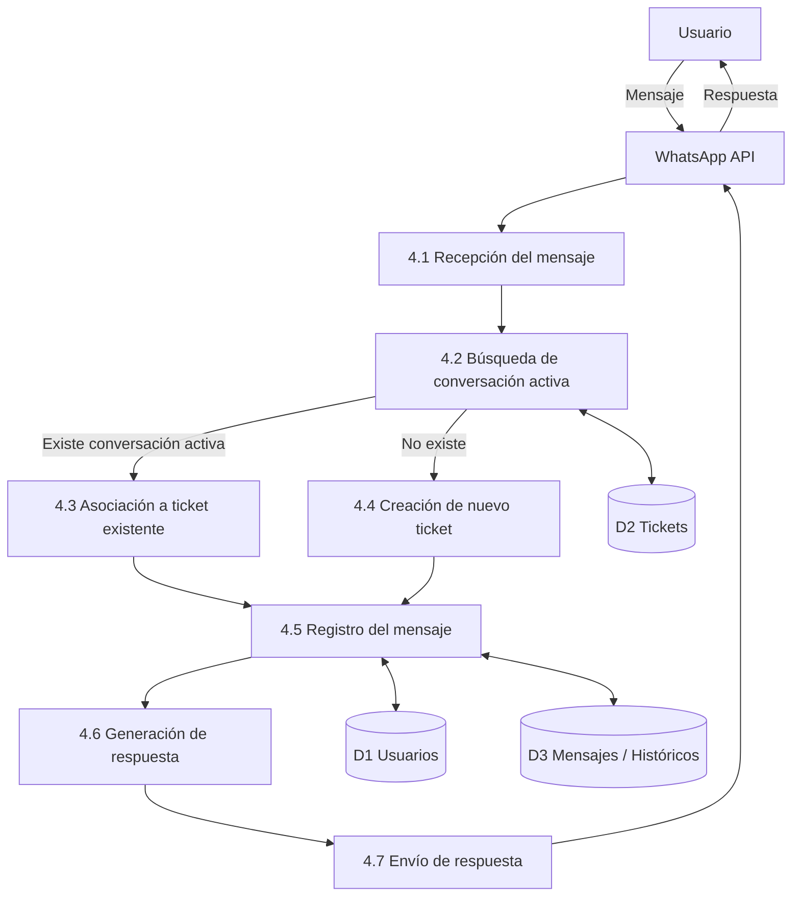

**Descripción:**  
Un mensaje de WhatsApp no debe generar automáticamente un nuevo ticket. Primero se comprueba si existe una conversación activa; si existe, el mensaje se agrega al ticket correspondiente. En caso contrario, se inicia un nuevo caso.

---

# Figura DFD-06. Gestión Operativa del Ticket – Nivel 2

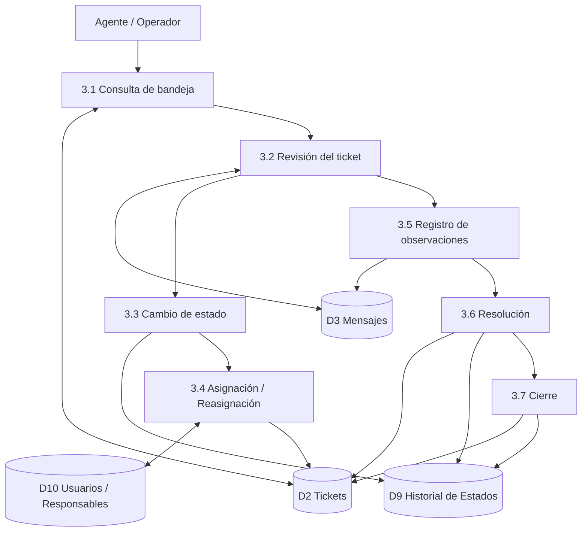

**Descripción:**  
El operador administra el ciclo de vida del ticket. Todos los cambios de estado, reasignaciones y acciones relevantes deben quedar registrados en un historial auditable.

---

# Figura DFD-07. Gestión de SLA y Alertas – Nivel 2

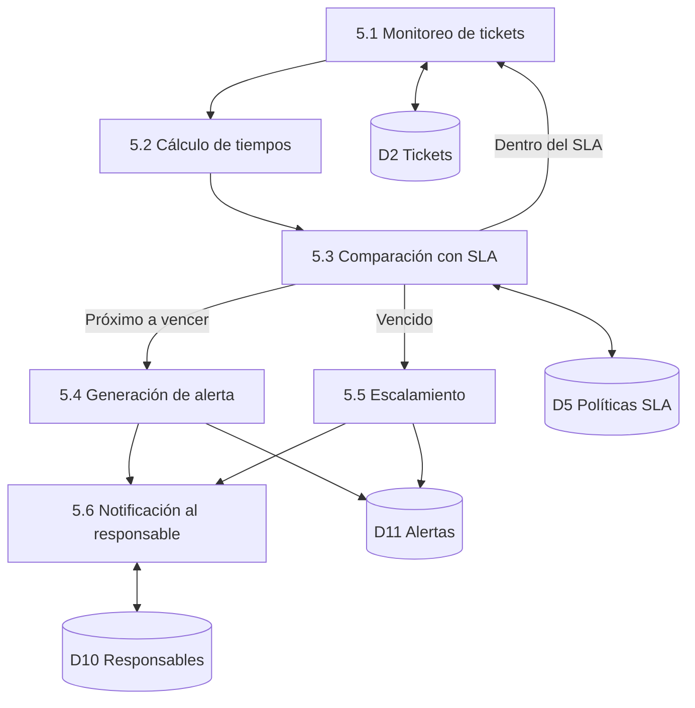

**Descripción:**  
El sistema debe controlar los tiempos de primera respuesta y resolución. Cuando un ticket se aproxima a su vencimiento o supera el SLA, se generan alertas y, cuando corresponda, procesos de escalamiento.

---

# Figura DFD-08. Integración Futura con el SGA – Nivel 2

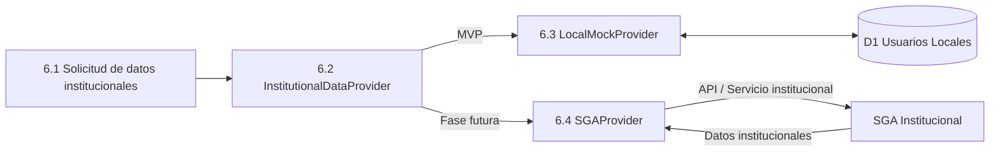

**Descripción:**  
Se propone una capa de abstracción denominada `InstitutionalDataProvider`. Durante el MVP se utilizará `LocalMockProvider`. Cuando la especificación del SGA esté disponible, podrá incorporarse `SGAProvider` sin alterar el núcleo de la aplicación.

---

# Figura DFD-09. Procesamiento mediante LLM – Nivel 2

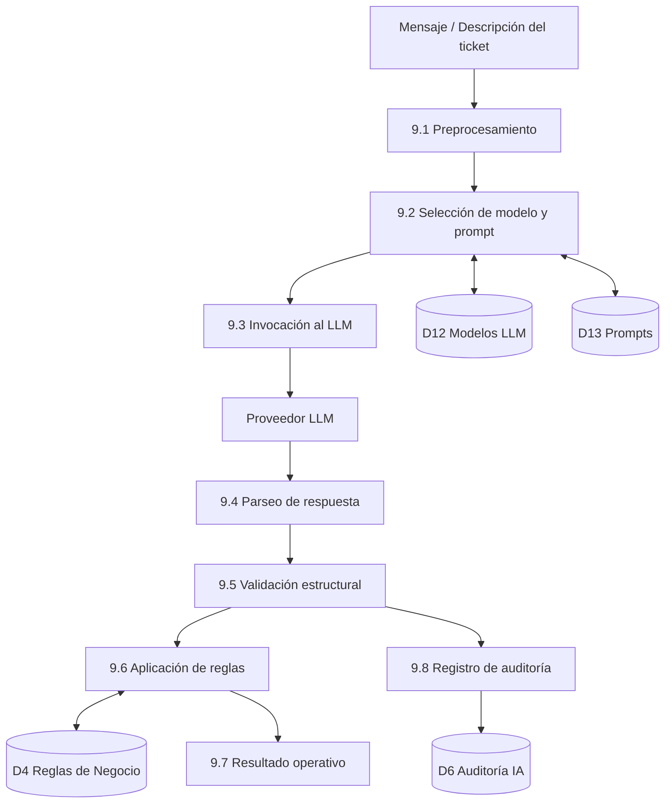

**Descripción:**  
El LLM funciona como un motor de interpretación semántica. Sus resultados deben transformarse a una salida estructurada y validarse antes de ser utilizados por la lógica de negocio.

Ejemplo esperado de salida:

```json
{
  "intent": "problema_matricula",
  "category": "ACADEMIC",
  "subcategory": "ENROLLMENT",
  "priority": "MEDIUM",
  "summary": "Usuario reporta inconveniente durante el proceso de matrícula",
  "confidence": 0.91
}
```

---

# Figura DFD-10. Fallback y Contingencia del Motor LLM

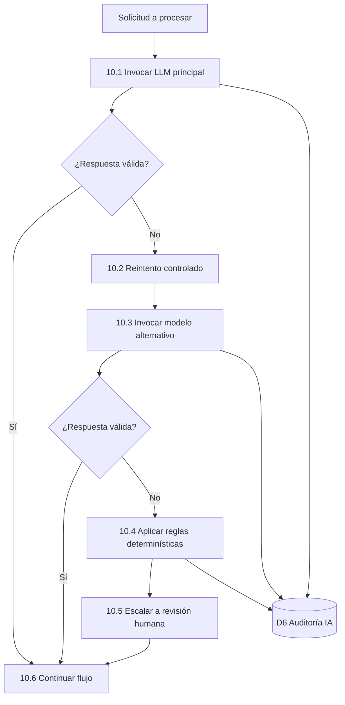

**Descripción:**  
El MVP debe garantizar continuidad incluso si el proveedor LLM falla. La estrategia contempla reintento, modelo alternativo, aplicación de reglas determinísticas y finalmente intervención humana.

---

# Figura DFD-11. Flujo Integral del Ticket

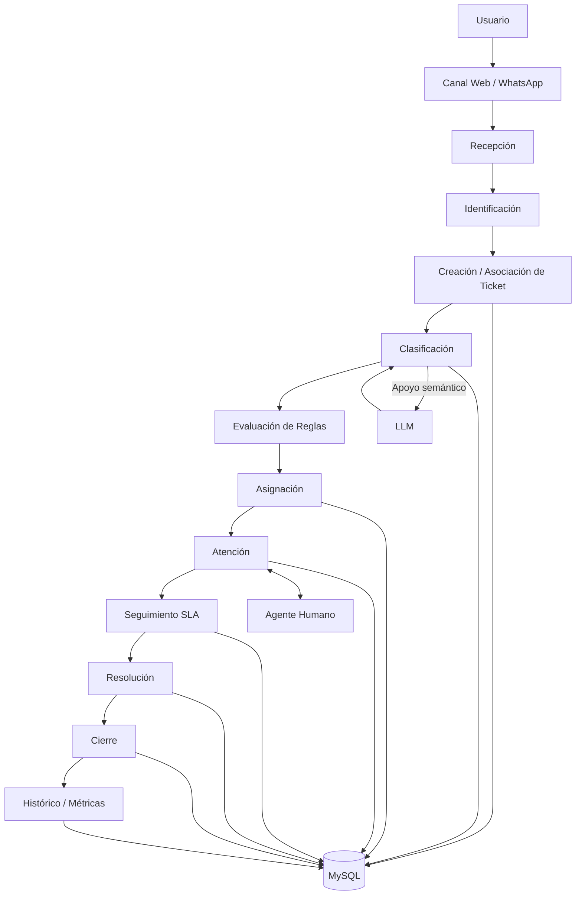

**Descripción:**  
Este diagrama sintetiza el ciclo completo del ticket y permite presentar el funcionamiento general del MVP en una sola vista.

---

# 12. Relación entre procesos y tablas principales

| Proceso | Tablas principales |
|---|---|
| Gestión de solicitudes | `users`, `user_types`, `channels` |
| Gestión de tickets | `tickets`, `ticket_statuses`, `ticket_status_history` |
| Clasificación | `ticket_categories`, `ticket_subcategories`, `business_rules` |
| Enrutamiento | `service_areas`, `ticket_assignments` |
| Conversación | `ticket_messages`, `ticket_attachments` |
| SLA | `sla_policies`, `alerts` |
| IA | `llm_models`, `llm_prompts`, `llm_usage`, `ai_decisions` |
| Auditoría | `audit_logs`, `ticket_status_history`, `ai_decisions` |

---

# 13. Consideraciones de diseño

1. El SGA no constituye una dependencia obligatoria para la ejecución del MVP.
2. Los datos institucionales deben consumirse posteriormente mediante una capa de integración desacoplada.
3. El LLM no debe controlar estados críticos ni ejecutar cierres automáticos de tickets.
4. Las decisiones administrativas y transacciones sensibles deben permanecer bajo reglas determinísticas o validación humana.
5. Todo resultado generado por IA debe ser auditable.
6. El sistema debe mantener trazabilidad completa de mensajes, cambios de estado, asignaciones, uso del LLM y tiempos de atención.
7. Las reglas de negocio deben mantenerse desacopladas del canal de entrada.
8. Web y WhatsApp deben converger en el mismo modelo de ticket.
9. El modelo de datos del MVP debe permanecer estable aunque posteriormente se incorpore el SGA.
10. La arquitectura debe permitir sustituir el proveedor LLM sin modificar la lógica principal del sistema.

---

# 14. Uso recomendado en el SDD

Estos diagramas pueden incorporarse dentro de una sección denominada:

**“Arquitectura funcional y Diagramas de Flujo de Datos del MVP”**

Orden recomendado:

1. DFD-01 – Contexto.
2. DFD-02 – Nivel 1.
3. DFD-03 – Registro de solicitudes.
4. DFD-04 – Clasificación y enrutamiento.
5. DFD-05 – WhatsApp.
6. DFD-06 – Gestión operativa.
7. DFD-07 – SLA.
8. DFD-08 – Integración SGA.
9. DFD-09 – Motor LLM.
10. DFD-10 – Fallback.
11. DFD-11 – Flujo integral.

Este conjunto permite explicar tanto la operación funcional como la arquitectura técnica del MVP sin depender todavía de la estructura real del SGA.
